# User Guide — ECG Analysis (Mouse Cardiac Toolkit)

*This is a walkthrough of the desktop application itself — what each tab
does and how to move through a typical analysis. For the full feature
list, installation, and project architecture, see the main
[README](../README.md).*

All screenshots in this guide were captured against a synthetic demo
recording (90 s, ~500 bpm baseline with a deliberately inserted
bradycardia/pause episode and a short irregular run), generated purely to
have something realistic to show — not real experimental data. Your own
recordings will look different; the workflow is identical.

## Contents

1. [Launching the app](#launching-the-app)
2. [Loading a recording](#loading-a-recording)
3. [R-peak detection](#r-peak-detection)
4. [Reading the Detection view](#reading-the-detection-view)
5. [HRV analysis](#hrv-analysis)
6. [Interval delineation](#interval-delineation)
7. [Abnormal events](#abnormal-events)
8. [Summary tab](#summary-tab)
9. [Experimental context & parameters](#experimental-context--parameters)
10. [Exporting & saving your work](#exporting--saving-your-work)
11. [Tips & troubleshooting](#tips--troubleshooting)

---

## Launching the app

```bash
python -m ecg          # preferred entry point
python ecg_app.py       # backward-compatible entry point
ecg-analysis            # after `pip install -e .`
```

The window opens on the **Detection** tab with no file loaded. The
toolbar along the top (**Open**, **Save**, **Detect Peaks**, **Analyze**,
undo/redo, the signal-quality badge, and the theme toggle) stays visible
no matter which tab you're on — everything downstream of loading a file
starts from there.

---

## Loading a recording

Click **Open** and pick a MATLAB `.mat` file — legacy v5/v6 or v7.3/HDF5
(Spike2 exports), both are handled automatically, including channel and
sampling-rate detection. The left sidebar's **Signal** section shows the
detected channel name and sampling rate (editable if auto-detection
guesses wrong), and the **Filters** section controls whether detection
runs on the raw signal or a bandpass/notch/cleaned version — see
[Reading the Detection view](#reading-the-detection-view) for what that
choice does to the display.

Opening a file immediately shows the raw trace with no processing. Nothing
is filtered, detected, or analyzed until you click **Detect Peaks**.

---

## R-peak detection


Click **Detect Peaks** to run the selected detection method (**Method**
dropdown in the left sidebar — Auto/NeuroKit2, Savitzky-Golay + derivative,
continuous wavelet transform, envelope-max, or your own trained ML
detector) over the whole recording. The detail plot shows the signal for
the current time window, with accepted peaks marked in green and the
active amplitude threshold as a dashed red line — drag the **Threshold**
slider in the sidebar (or type an exact value) to tighten or loosen
detection without re-running the whole pipeline.

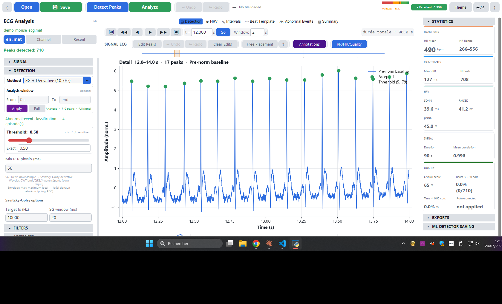

Use the navigation bar above the plot (◀◀ / ◀ / ▶ / ▶▶, or type a time and
click **Go**) to move through the recording, and the **Window** field to
widen or narrow how many seconds are visible at once. If a peak is
missed or a false one is added, **Edit Peaks** switches into manual
edit mode — click near a peak to remove it, or in empty space (with
**Free Placement** on) to add one — with full undo/redo.

The right-hand **Statistics** panel updates live as you work: heart rate,
RR intervals, HRV (SDNN/RMSSD/pNN6), and a signal-quality score built
from how closely each beat matches the recording's own beat template.

---

## Reading the Detection view

The detail plot always shows two traces, layered on top of each other:

- The **primary trace** (solid) — whichever of raw/filtered you have
  selected via the sidebar's "Show raw signal" toggle.
- A **ghost trace** (faint, 20% opacity) — the other one, so the effect
  of filtering is always visible even when you're focused on the raw
  view.

**Blue is raw, purple is filtered** — a fixed color convention across the
whole app, so you can tell at a glance which one you're looking at
without reading the label. Green dots are accepted peaks; a red dashed
line is the active detection threshold.

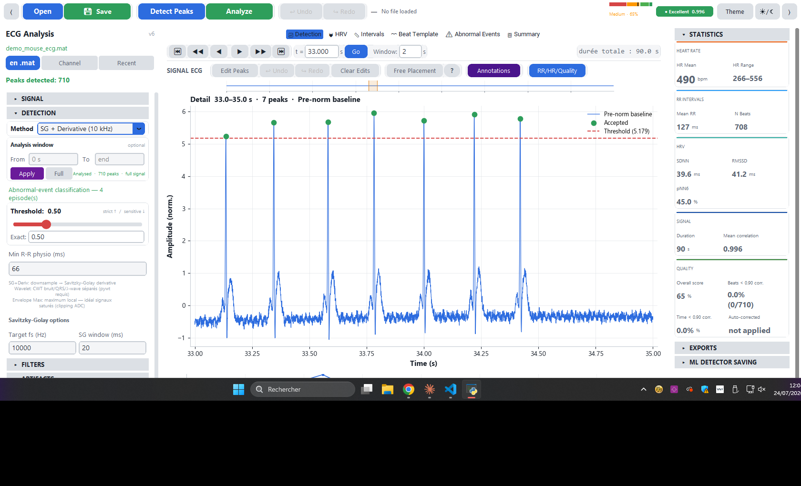

The screenshot above is zoomed into the demo recording's inserted
bradycardia episode — note the visibly wider spacing between peaks
compared to the baseline window shown earlier. This is exactly the kind
of thing the [Abnormal Events](#abnormal-events) tab classifies
automatically across the whole recording, so you don't have to spot it
by scrolling through manually.

---

## HRV analysis

Click **Analyze** (or the per-view buttons described below) to compute
heart-rate variability metrics. The **HRV** tab has six linked sub-views,
selectable from the row of buttons under the tab bar.

### RR/HR

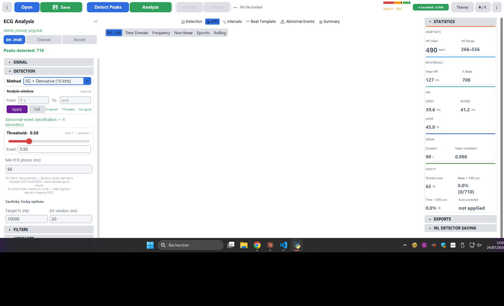

A tachogram of every RR interval and instantaneous heart rate across the
recording, with automatic spike detection (sudden acceleration/
deceleration) and click-to-navigate — click a point here and the
Detection tab jumps straight to that moment.

### Time Domain

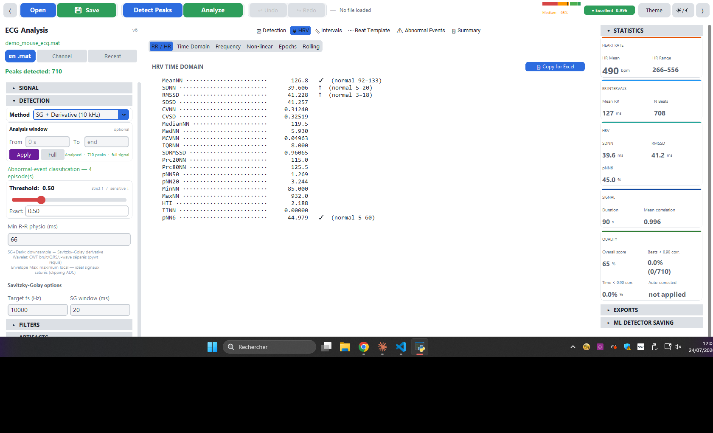

The full time-domain metric set (SDNN, RMSSD, pNN6, SDANN, TINN, HTI...),
each annotated with a ✓ / ~ / ↑ / ↓ status against the active
[experimental context](#experimental-context--parameters)'s reference
range.

### Frequency

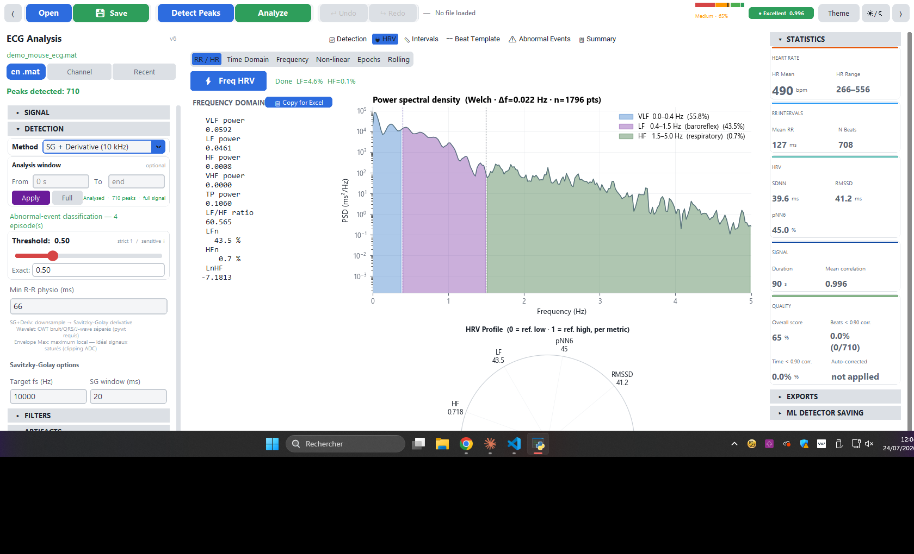

A Welch power spectral density plot with mouse-specific VLF/LF/HF band
shading (not the human 0.04–0.15/0.15–0.4 Hz convention), plus an
HRV-profile radar chart where each axis is normalized against its own
physiological reference range.

### Non-linear

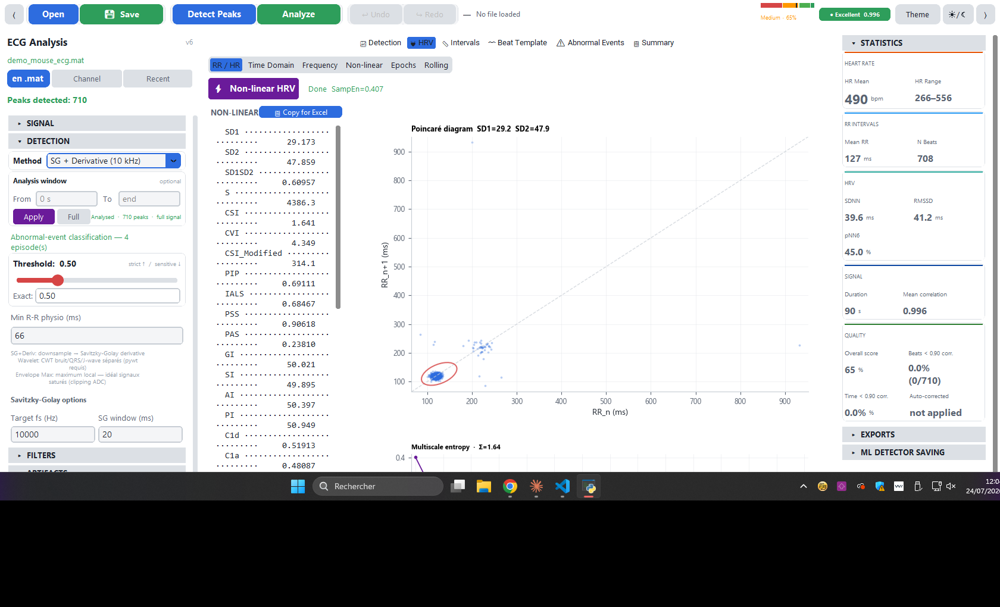

A Poincaré scatter with an SD1/SD2 ellipse overlay, sample entropy, DFA,
and a multiscale entropy (MSEn) curve across coarse-graining scales.

### Epochs

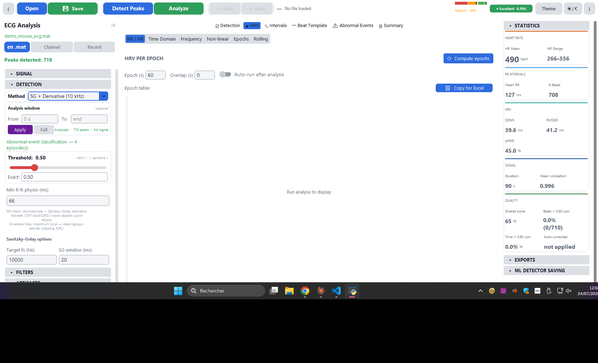

Fixed-window HRV trends, with low-beat-count windows visually flagged so
a noisy stretch doesn't get read as a real physiological change.

### Rolling

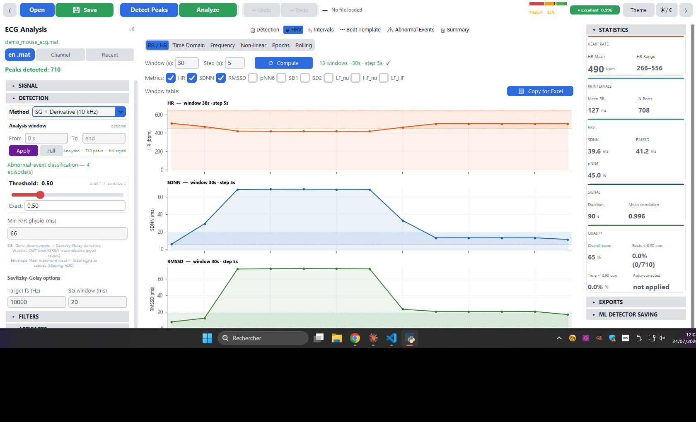

Sliding-window HRV trends with a results table alongside the plot —
useful for watching a metric drift continuously rather than in discrete
epochs.

---

## Interval delineation

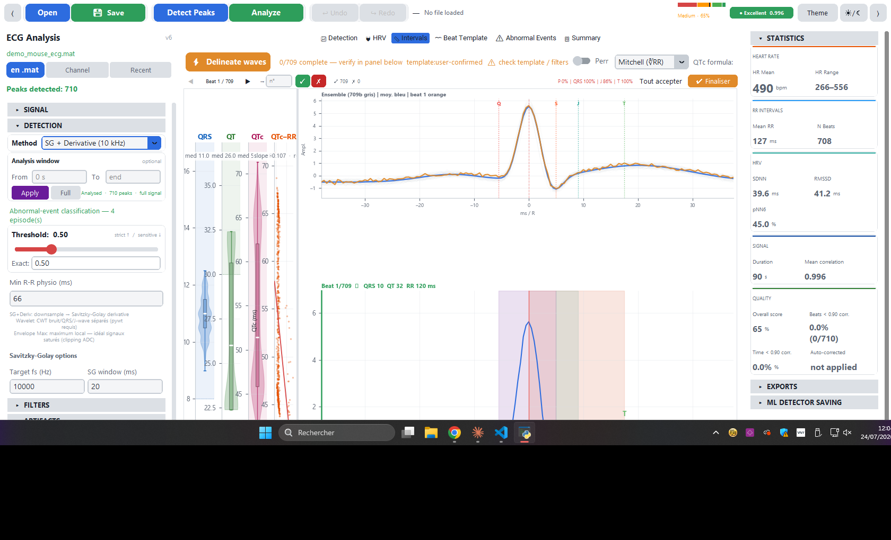

Click **Delineate Waves** to locate P/Q/R/S/J/T landmarks on every beat
and compute PR/QRS/QT/QTc intervals. The panel on the left is a beat
verifier — step through individual beats (or the ensemble average) and
correct the template if the automatic landmark placement looks wrong
before trusting the QT/QTc numbers. The **QTc formula** dropdown switches
between Mitchell (default, mouse-calibrated), Bazett, and Hodges — the
distribution plots on the right update immediately so you can judge
which correction actually removes this recording's rate-dependence
rather than trusting one formula's number blindly.

---

## Abnormal events

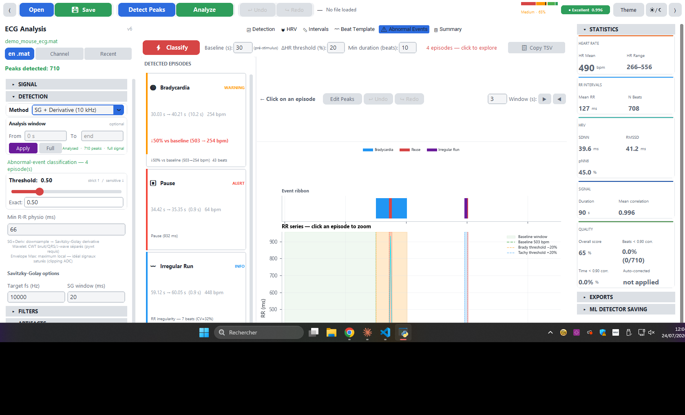

Click **Classify** to detect bradycardia/tachycardia runs, pauses,
ectopic-beat runs, irregular-rhythm runs, and AV conduction-delay
episodes — all measured against this recording's own baseline heart
rate, not a fixed cutoff. The color-coded ribbon at the top gives an
at-a-glance view of where events cluster; each card on the left is one
episode. Click a card (or a ribbon segment) to zoom the RR-series plot
straight to that episode — in the screenshot above, the demo recording's
inserted bradycardia, pause, and irregular run were all found and are
listed with their exact timing and severity.

**Baseline (s)**, **ΔHR threshold (%)**, and **Min duration (beats)** at
the top control sensitivity — widen the baseline window or loosen the
threshold if real events are being missed, or tighten them if normal
variability is being over-flagged.

---

## Summary tab

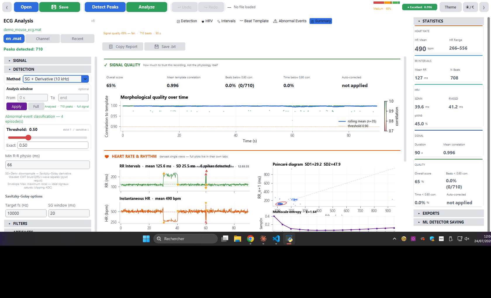

A single-page rollup of everything computed so far: signal quality over
time, RR intervals with spikes marked, instantaneous HR, the Poincaré
diagram, and the multiscale entropy curve — plus **Copy Report** and
**Save .txt** to get a plain-text version for a lab notebook or a quick
message to a colleague, without needing the full PDF/Excel export.

---

## Experimental context & parameters

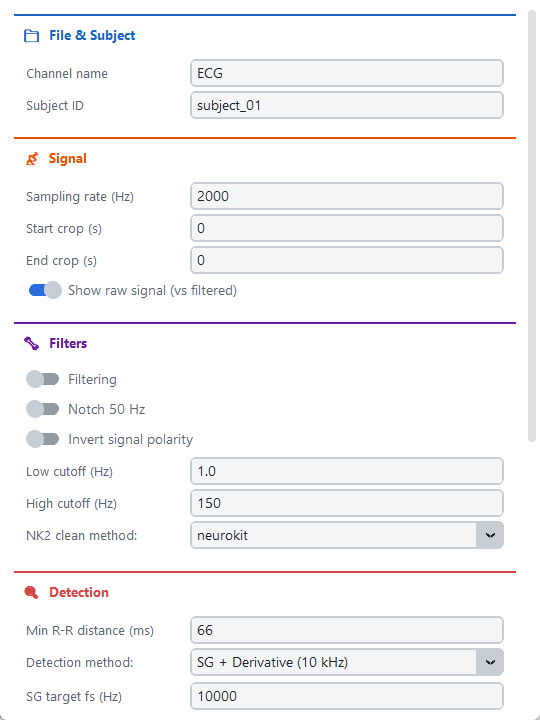
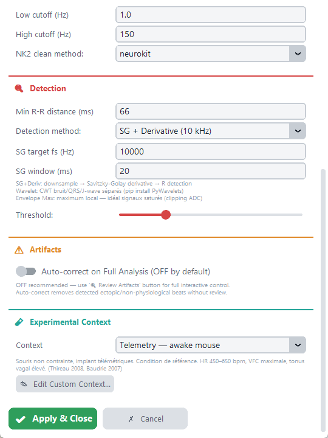

Open **Parameters** (gear icon area of the toolbar) for every setting
that affects analysis: channel/subject metadata, sampling rate override,
filter cutoffs, detection thresholds, and — the section shown on the
right — **Experimental Context**.

Every reference range shown anywhere in the app (the ✓/~/↑/↓ status
marks, the shaded bands on distribution plots, the radar chart's
normalization) is read from whichever context is selected here: four
built-in mouse physiological contexts (telemetry/awake, isoflurane,
ketamine/xylazine, surface electrodes), or **Edit Custom Context…** to
define your own — useful if you work with a specific strain or protocol
that the built-in ranges don't represent well. The custom context is
saved to disk and stays selectable across sessions, right alongside the
built-in four.

---

## Exporting & saving your work

- **Save Session** (toolbar, or `Ctrl+S`) writes a `.ecgsession` file with
  every result computed so far, so reopening it later restores the exact
  state — no need to re-run detection or analysis.
- The **Export** menu (toolbar dropdown) covers everything else: a
  formatted Excel workbook, GraphPad Prism `.pzfx`, a one-page PDF report
  (signal strip, key metrics, Poincaré diagram, HRV radar, abnormal-events
  summary), a per-episode annotated PDF for abnormal events, and CSV.
- If you're building a training set for the ML R-peak detector, **Save
  for Training** (right panel, ML Detector Saving section) caches this
  recording's corrected peaks without needing a full session save.

---

## Tips & troubleshooting

- **The trace looks flipped/upside-down where you didn't expect it** —
  the detection pipeline includes an automatic polarity-correction vote
  when filtering is enabled, so it can re-orient the signal for
  detection accuracy. If you specifically want the signal left exactly
  as loaded, turn **Filtering** off (the default) rather than on — raw/
  no-filter mode always leaves polarity untouched.
- **A window/dialog seems to freeze on close** — give background
  operations (Detect Peaks, Analyze, Classify) a moment to finish; the
  toolbar's progress bar and ETA readout show whether something is still
  running.
- **Reference ranges don't look right for your data** — check which
  [experimental context](#experimental-context--parameters) is active;
  the four built-ins assume specific conditions (anesthesia, restraint,
  electrode placement) that materially shift normal HR/HRV ranges in
  mice. Define a custom context if none of the four fit.
- **No automated test suite** covers the GUI itself — if something looks
  wrong after an update, cross-check the affected tab's numbers against
  the Summary tab or a known-good session file before trusting a new
  result.
